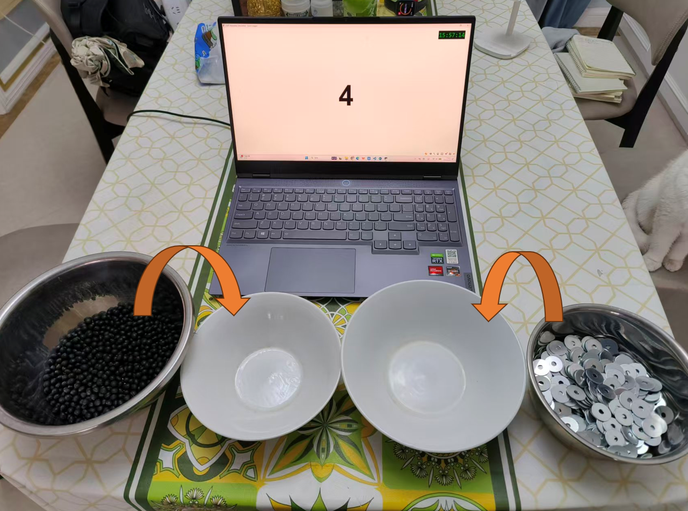
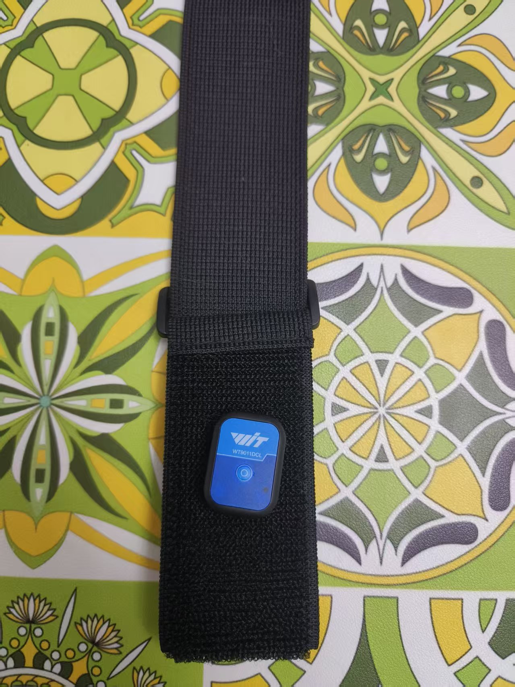
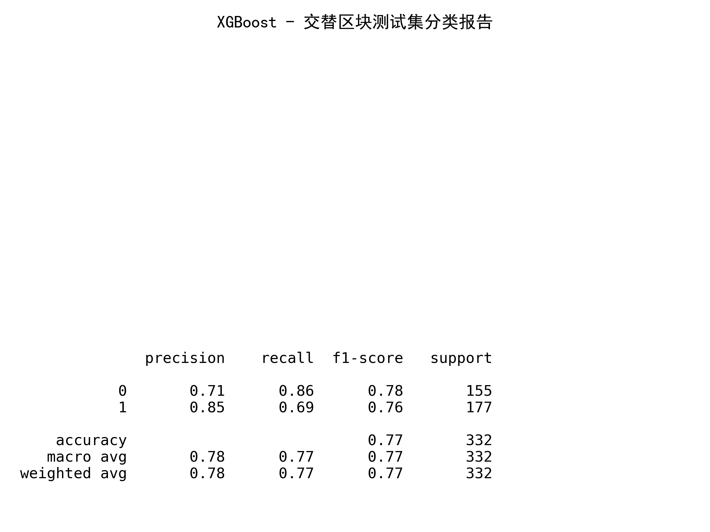
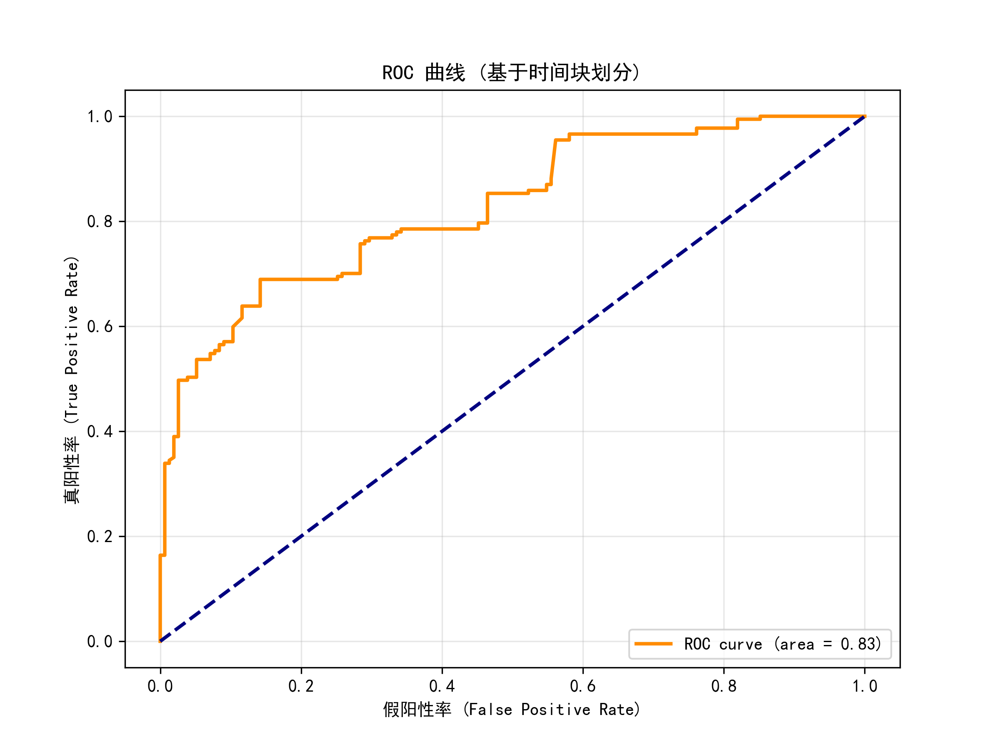
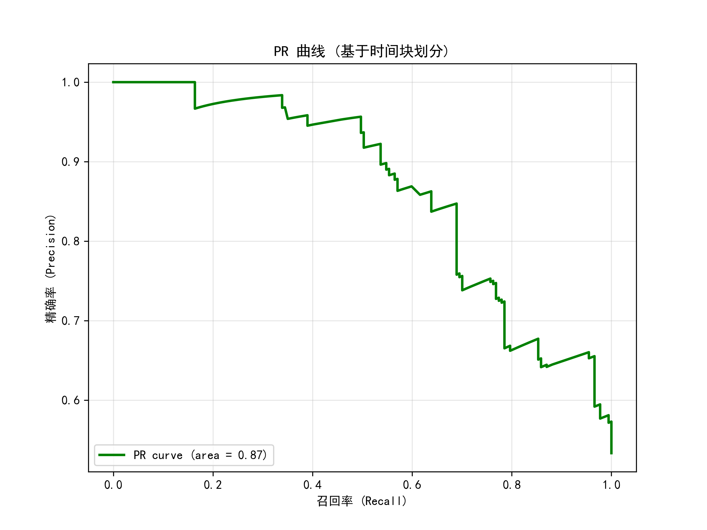
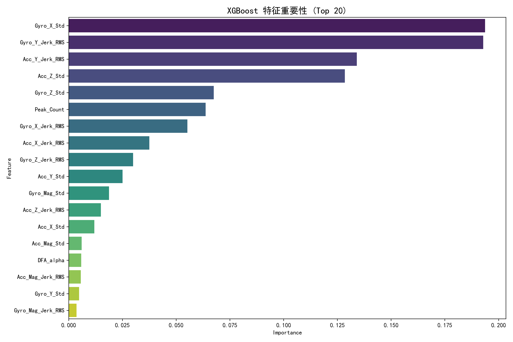

# Research on Assembly Error Prediction and Dynamic Rest Strategy Based on Motion Sensors

## Abstract
This research utilizes wearable sensor technology to monitor worker fatigue, explores the predictive capability of motion data for assembly risks, and validates the effectiveness of optimized rest strategies in reducing error rates.
> **Wrist-worn Sensor** $\rightarrow$ **Multimodal Hybrid Deep Learning** $\rightarrow$ **Fatigue Monitoring** $\rightarrow$ **Assembly Error Prediction** $\rightarrow$ **Adaptive Intervention** *(AI-guided rest scheduling in iso-temporal conditions)*

---

## 1. Research Objectives

* **Predictive Modeling**: To verify whether wrist motion data can effectively predict assembly error risks within the next 5 minutes.
* **Intervention Strategy Validation**: To compare the "AI-guided Rest Strategy Based on Dynamic Fatigue Metrics" with the "Traditional Fixed-Interval Rest," evaluating the former's advantages in alleviating fatigue and reducing assembly errors under iso-temporal conditions.
* **Architecture & Interpretability Benchmark**: To evaluate tree-based models (e.g., XGBoost) against hybrid deep learning architectures (e.g., CNN-LSTM) for robustness, while leveraging **Explainable AI (XAI)** warning triggers are transparent.

---

## 2. Experimental Environment and Apparatus

### 2.1 Hardware Configuration
| Category | Device/Component | Description |
| :--- | :--- | :--- |
| **Material System** | Source Containers | Two iron bowls containing "washers" and "beans" respectively. |
| | Target Containers | Two ceramic bowls simulating the finished assembly area. |
| **Visual Induction** | PC Terminal | Running the experimental program, randomly switching digits (0-9) every 3 seconds. |
| **Sensor Node** | 9-axis IMU | Wrist-worn sensor collecting 3-axis Acceleration (Acc), Gyroscope (Gyro), and Euler Angles (Angle). |

<table border="0">
  <tr>
    <td align="center">
      
       
      <b>Figure 1: Experimental Setup</b>
    </td>
    <td align="center">
      
       
      <b>Figure 2: 9-axis Motion Sensor</b>
    </td>
  </tr>
</table>

### 2.2 Logic Design
* **Pace**: The screen will randomly generate a number between 0 and 9 every 3 seconds. (high-intensity repetitive task).
* **Task Branches**:
    * **Standard Task (Digit ≠ 3)**: Move "beans" directly into the ceramic bowl.
    * **Anomaly Task (Digit = 3)**: Move "washer" into the ceramic bowl first, then move "beans" into the ceramic bowl.

---

## 3. Experimental Scenes Explanation 

### Theoretical Background
When performing highly repetitive tasks, the brain easily enters **"Autopilot"** mode. Over time, physiological and psychological fatigue accumulates, leading to a decline in **Vigilance**. At this point, if a "non-standard action" requiring extra attention appears, workers often make omissions or sequence errors due to inertia.

### Industrial scene: Automotive Hood Seal Installation Line
* **Scenario Description**: A worker installs a standard seal every 15 seconds (corresponding to the "Digit ≠ 3" task). Due to the mechanical nature, it relies purely on muscle memory.
* **Anomaly Trigger**: Occasionally, a "Luxury Version" chassis appears, requiring a special adhesive to be applied before the seal (corresponding to the "Digit = 3" task).
* **Error Risk**: After working for 2 hours without rest, the worker may "see but not perceive" the luxury chassis due to deep fatigue, directly applying the seal by muscle memory and omitting the adhesive step.

---

## 4. Data Processing and Expected Results

### 4.1 Data Processing and Feature Extraction
Sensor data undergoes 15Hz low-pass filtering, outlier removal, and normalization. A total of **18 features** are extracted, with assembly errors (labeled via video review) serving as ground truth:
* **Time-Domain**: Standard Deviation (Std) of each axis and magnitude.
* **Kinematic**: Jerk Root Mean Square (Jerk_RMS), Peak Count.
* **Non-linear**: DFA-alpha ($DFA_\alpha$), etc.

### 4.2 Expected Outcomes
1.  **Algorithmic Evaluation Framework**: Validating the effectiveness of composite motion features in predicting assembly errors under high cognitive load; building and comparing static vs. temporal fatigue prediction models.
2.  **Adaptive Intervention Paradigm**: Proposing an adaptive rest algorithm that optimizes intervention timing without increasing total downtime, filling the gap between "fatigue monitoring" and "active intervention" in industry.

## 5. Proof of Concept (PoC)

Data collection for the first **3 participants** has been completed. After feature engineering, the processed data was used to train an **XGBoost** model. Initial results successfully validate the core hypothesis: **"Motion features (IMU data) can effectively predict assembly error risks."**

### Preliminary Model Performance Metrics:

<table border="0">
  <tr>
    <td align="center" width="50%">
      
       
      <b>Figure 3: Classification Report</b>
    </td>
    <td align="center" width="50%">
      
       
      <b>Figure 4: ROC Curve</b>
    </td>
  </tr>
  <tr>
    <td align="center" width="50%">
      
       
      <b>Figure 5: PR-AUC Curve</b>
    </td>
    <td align="center" width="50%">
      
       
      <b>Figure 6: Feature Importance Analysis</b>
    </td>
  </tr>
</table>

### 6. Future Roadmap

* **Better Generalization**: Expand the dataset and use **Leave-One-Subject-Out (LOSO)** cross-validation to ensure the model works accurately for new users.

* **Model Optimization**: Improve feature engineering and tuning to compare **Tree-based models** (XGBoost) with **Deep Learning** (CNN-LSTM) for better accuracy.
* **System Integration**: Move from offline analysis to **real-time detection**, using fatigue data as dynamic **factors** for **AI scheduling** systems.
